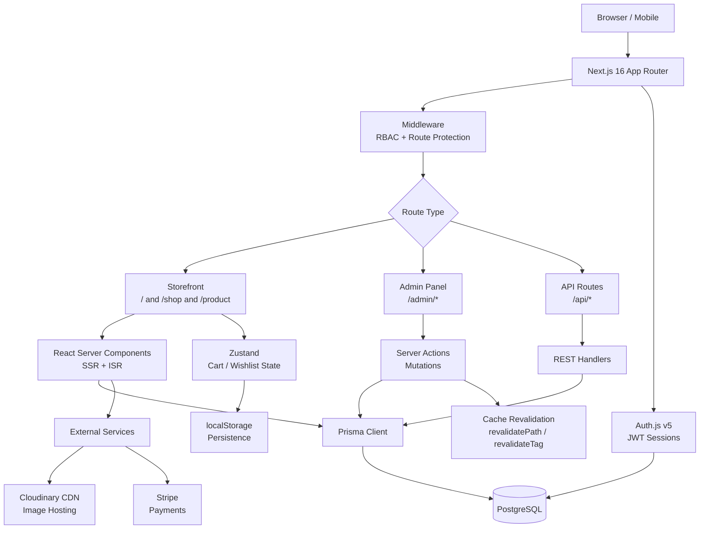
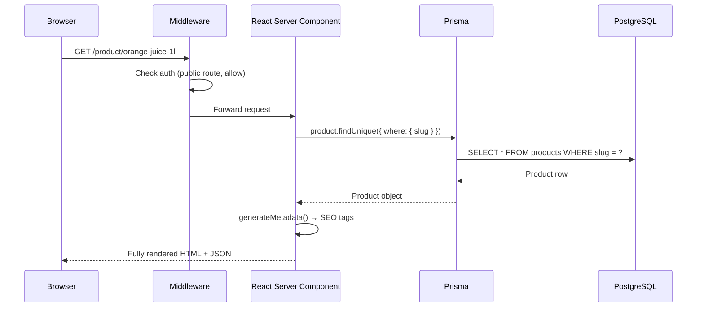
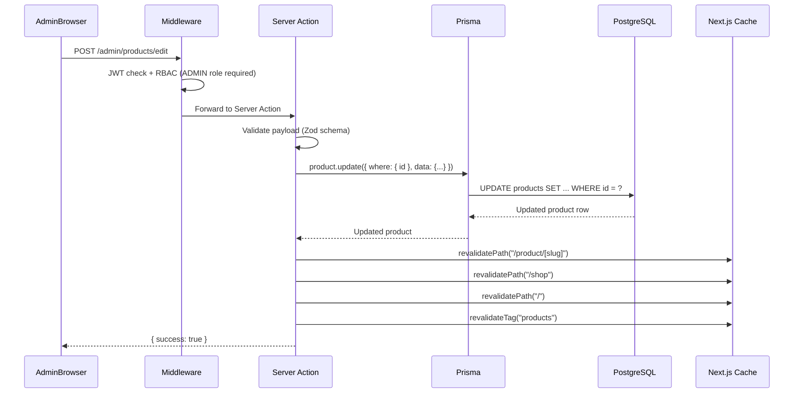
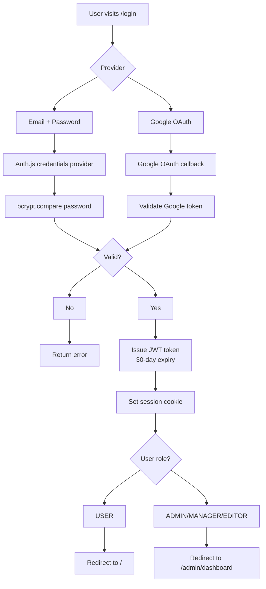
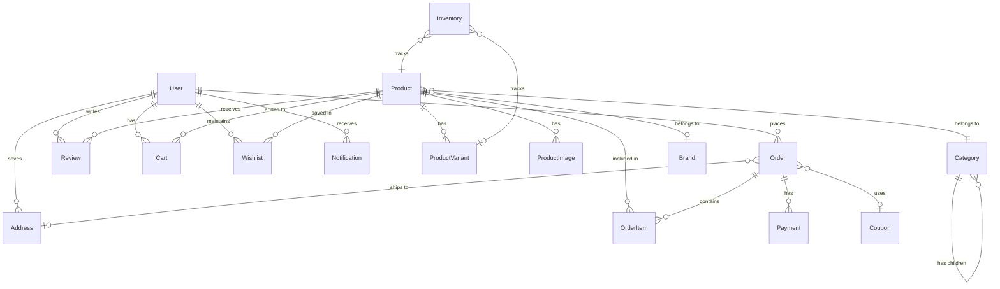

# Architecture — FreshMart Pro

This document explains the complete system architecture and request flow of FreshMart.

---

## High-Level Overview



---

## Request Flow — Storefront (Read Path)



---

## Request Flow — Admin Mutation (Write Path)



---

## Authentication Flow



---

## Data Model Relationships



---

## Folder Architecture

```
freshmart/
│
├── app/                          # Next.js App Router
│   ├── (auth)/                   # Unauthenticated auth pages
│   ├── (storefront)/             # Public-facing store
│   │   ├── (shop)/               # Shopping routes
│   │   │   ├── cart/
│   │   │   ├── category/[slug]/
│   │   │   ├── checkout/
│   │   │   ├── product/[slug]/
│   │   │   └── shop/
│   │   └── (user)/               # Authenticated user routes
│   │       └── dashboard/
│   ├── admin/                    # Admin panel routes (RBAC protected)
│   └── api/                      # REST API endpoints
│
├── components/                   # React components
│   ├── admin/                    # Admin-only components
│   ├── product/                  # Product cards, detail, form
│   ├── sections/                 # Homepage sections
│   └── ui/                       # Base UI primitives
│
├── lib/
│   ├── actions/                  # Server Actions (mutations)
│   └── prisma.ts                 # Singleton Prisma client
│
├── context/                      # React Context providers
├── hooks/                        # Custom hooks
├── prisma/                       # Schema + migrations + seeds
└── types/                        # Shared TypeScript interfaces
```

---

## Key Design Decisions

### Why Next.js Server Components?
Product pages, category pages, and the admin panel use React Server Components (RSC) by default. This means **zero client-side JavaScript** is shipped for data fetching — the DB query runs server-side and the rendered HTML is streamed directly to the browser. This results in best-in-class Core Web Vitals scores.

### Why Zustand for Cart?
Cart state needs to persist across page navigations and survive page refreshes without a network roundtrip. Zustand provides a tiny (~1KB) state store with built-in `localStorage` persistence middleware. A full Redux setup would be overkill.

### Why Prisma?
Prisma's type-safe query builder eliminates a whole class of runtime errors. It generates TypeScript types directly from the schema, meaning the IDE catches field mismatches at compile-time rather than in production.

### Why Cursor Pagination on the Shop API?
Offset-based pagination (`LIMIT x OFFSET y`) degrades to O(n) as page number increases — PostgreSQL must scan and discard all preceding rows. Cursor-based pagination (`WHERE id > cursor LIMIT x`) is always O(1) regardless of dataset size. This is critical for a shop catalogue that can have thousands of products.
